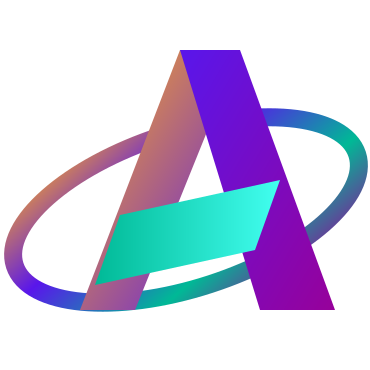

<div align="center">



# Animator — 3D Model Animation Studio

<a href="LICENSE"></a>
<a href="https://tauri.app/"></a>
<a href="https://reactjs.org/"></a>
<a href="https://www.typescriptlang.org/"></a>
<a href="https://vitejs.dev/"></a>
<a href="https://threejs.org/"></a>

**A powerful cross-platform 3D model animation studio — import rigged models, inspect bone hierarchies, hand-author keyframe animations, apply premade humanoid clips, and export polished GLB files. Built with React, Tauri, and Rust, with GitHub Actions for multi-platform builds and releases.**

[Features](#-features) • [Installation](#-installation) • [Usage Guide](#-usage-guide) • [Running & Building](#-running-the-application) • [GitHub Actions](#-github-actions-build--release) • [Icons](#-icons-generation) • [Contributing](#-contributing)

---

</div>

## 📖 Table of Contents

- [About](#-about)
- [Features](#-features)
- [Technology Stack](#-technology-stack)
- [Prerequisites](#-prerequisites)
- [Installation](#-installation)
- [Running the Application](#-running-the-application)
- [Usage Guide](#-usage-guide)
- [Building for Production](#-building-for-production)
- [GitHub Actions (Build & Release)](#-github-actions-build--release)
- [Icons Generation](#-icons-generation)
- [Project Structure](#-project-structure)
- [Configuration](#-configuration)
- [Contributing](#-contributing)
- [Support](#-support)
- [License](#-license)
- [About Roboticela](#-about-roboticela)

---

## 🌟 About

**Animator** is a powerful cross-platform 3D model animation studio that makes rigging, inspecting, and animating 3D models accessible to everyone. Designed for game developers, artists, educators, and hobbyists alike, it delivers a professional-grade animation workflow directly in the browser or as a native desktop application.

Built with modern technologies including **Tauri**, **React**, **React Three Fiber**, **Three.js**, **TypeScript**, and **Rust**, Animator brings 3D model animation to life through real-time skeletal rendering, interactive bone gizmos, a keyframe timeline, and a rich premade animation library.

Whether you're polishing a game character, testing a rigged model, creating animated assets for the web, or just exploring 3D animation for the first time, Animator offers a complete workflow from import to export — all running locally on your machine.

The application runs as a native desktop application through **Tauri 2** on Linux, Windows, and macOS, and also works entirely in the browser without installation. It includes automated multi-platform build pipelines, release workflows, and asset generation tools.

### Why Animator?

- ✅ **Free and Open Source** — Licensed under AGPL-3.0
- ✅ **Cross-Platform** — Works on Linux, Windows, and macOS, plus in any modern browser
- ✅ **Fast & Lightweight** — Built with Rust and Tauri for excellent native performance
- ✅ **Multiple Format Support** — Import GLB, GLTF, FBX, and OBJ models
- ✅ **Full Skeletal Inspection** — Armature tree, bone hierarchy, and per-bone transform readout
- ✅ **Embedded Clip Playback** — Plays animations baked into imported files automatically
- ✅ **Premade Animation Library** — Idle, walk, run, wave, jump, spin, dance, and more
- ✅ **Custom Keyframe Authoring** — Move / rotate / scale gizmo with per-bone keyframes
- ✅ **Timeline Editor** — Scrub, play, set in/out points, undo/redo support
- ✅ **GLB Export** — Native Save dialog on desktop; browser download on web
- ✅ **HTML to 3D** — Convert HTML content into 3D scene elements
- ✅ **Texture Management** — Per-material texture maps with live preview
- ✅ **Privacy First** — Everything stays local; no external servers required
- ✅ **No Installation Needed** — Runs in the browser without setup
- ✅ **Active Development** — Regular improvements and feature additions

---

## ✨ Features

### 🗂️ Model Import

- Drag-and-drop or file picker import
- Native open dialog on desktop (Tauri)
- Support for **GLB**, **GLTF**, **FBX**, and **OBJ** formats
- Built-in procedural sample humanoid rig — try without uploading a file
- Automatic scene centering and camera fit on import

### 🦴 Skeletal Inspection

- Full armature / bone tree panel with expand and collapse
- Per-bone transform readout (position, rotation, scale)
- Bone selection highlighting in the 3D viewport
- Mesh stats and model hierarchy overview
- Material and texture inspection per mesh

### 🎬 Animation Playback

- Plays **embedded clips** baked into the imported file
- Animated clip list with thumbnail previews
- Virtual scrolling animation grid for large libraries
- Transport controls: play, pause, stop, loop

### 🤸 Premade Animation Library

- Procedural humanoid animations using bone-name heuristics
- Built-in clips: **idle**, **walk**, **run**, **wave**, **jump**, **spin**, **dance**, and more
- Works with Mixamo, Unity, and VRM naming conventions
- Partial matching for unusual rigs

### ✏️ Custom Keyframe Authoring

- **Bone gizmo** — move (`W`), rotate (`E`), and scale (`R`) modes
- Per-bone keyframe recording on the timeline
- Timeline scrub, play/pause, and in/out point controls
- Full **undo / redo** (`Ctrl+Z` / `Ctrl+Y`)
- `Space` to play/pause · `Esc` to deselect bone

### 🎨 Texture & Material Management

- Per-material texture maps panel: albedo, normal, roughness, metalness, emissive, AO
- Drag-and-drop texture file loading
- Texture folder batch import with auto-mapping prompt
- Live material preview in the viewport

### 🌐 HTML to 3D

- Convert HTML content into 3D scene elements
- Dedicated panel and modal workflow
- Seamlessly integrates web content into your 3D scene

### 📤 Export

- **GLB** export (always GLB for maximum compatibility)
- Native Save dialog on desktop (Tauri)
- Browser download on web
- Bakes custom keyframe animations into the exported file

### 🖥️ Viewport & Scene

- React Three Fiber 3D viewport with orbit controls
- Reference image import and overlay for tracing
- Scene lighting controls (ambient, directional, environment)
- Bone skeleton overlay on top of the mesh
- Gizmo controller with axis snapping

### 🏗️ Build & Release

- Automated GitHub Actions workflows
- Multi-platform build support (Linux, Windows, macOS, Android)
- Multi-architecture releases
- Asset checksum generation

### 🎨 Icon System

- Single-source SVG icon generation
- Desktop icons
- Android adaptive icons
- Web favicons and application assets

---

## 🛠️ Technology Stack

| Layer           | Technology |
|----------------|------------|
| Frontend        | [React 19](https://reactjs.org/), [TypeScript 5.x](https://www.typescriptlang.org/), [Vite 7](https://vitejs.dev/), [TailwindCSS 4](https://tailwindcss.com/), [Framer Motion 12](https://www.framer.com/motion/), [Lucide React](https://lucide.dev/) |
| 3D / Animation  | [Three.js](https://threejs.org/), [React Three Fiber](https://docs.pmnd.rs/react-three-fiber/), [@react-three/drei](https://github.com/pmndrs/drei), [three-stdlib](https://github.com/pmndrs/three-stdlib) |
| State Management | [Zustand](https://github.com/pmndrs/zustand) |
| UI Components   | [Radix UI](https://www.radix-ui.com/) (Dialog, Dropdown, Slider, Tabs), [react-colorful](https://github.com/omgovich/react-colorful) |
| Desktop/Mobile  | [Tauri 2](https://tauri.app/), [Rust](https://www.rust-lang.org/) |
| Tooling         | ESLint, npm, [vite-plugin-sitemap](https://github.com/jbaubree/vite-plugin-sitemap) |

---

## 📋 Prerequisites

### Required
- **Node.js** (v20+, workflow uses 24) — [Download](https://nodejs.org/)
- **npm** — Node package manager
- **Rust** (latest stable) — [Install](https://www.rust-lang.org/tools/install)

### Platform-specific (for local builds)

#### Linux (Ubuntu/Debian)
```bash
sudo apt update
sudo apt install libwebkit2gtk-4.1-dev libappindicator3-dev librsvg2-dev \
  patchelf libsoup-3.0-dev libjavascriptcoregtk-4.1-dev
```

#### Linux (Fedora)
```bash
sudo dnf install webkit2gtk4.1-devel openssl-devel libappindicator-gtk3-devel librsvg2-devel
```

#### macOS
```bash
xcode-select --install
```

#### Windows
- [Visual Studio C++ Build Tools](https://visualstudio.microsoft.com/visual-cpp-build-tools/)
- [WebView2](https://developer.microsoft.com/en-us/microsoft-edge/webview2/) (usually pre-installed on Windows 10/11)

#### Android (local)
- JDK 17, Android SDK, NDK (e.g. 27.0.12077973 as in workflow)
- `npx tauri android init` once; see [Tauri Android](https://v2.tauri.app/develop/android/)
- **Windows only:** enable [Developer Mode](https://learn.microsoft.com/en-us/windows/apps/get-started/enable-your-device-for-development) (Settings → System → For developers). Tauri links `libapp_lib.so` into `src-tauri/gen/android/.../jniLibs` with a **symbolic link**; without Developer Mode the build fails with *"Creation symbolic link is not allowed for this system"* ([upstream discussion](https://github.com/tauri-apps/tauri/issues/10937)). Keep the project on an **NTFS** drive (not exFAT/FAT32).
- If Gradle/Kotlin reports *"this and base files have different roots"* (e.g. repo on **D:** and Cargo/registry on **C:**), builds can still succeed. If problems persist, put the **project on the same drive** as your user profile (where `.cargo` lives) or add `kotlin.incremental=false` in `src-tauri/gen/android/gradle.properties` after `tauri android init`.

---

## 📥 Installation

```bash
git clone https://github.com/Roboticela/animator.git
cd animator
npm install
```

Optional: build Rust for desktop once:
```bash
cd src-tauri && cargo build && cd ..
```

---

## 🚀 Running the Application

### Frontend only (web)
```bash
npm run dev
```
Then open http://localhost:5173.

### Desktop (Tauri + Vite dev server)
```bash
npm run dev:desktop
```
Starts Vite and opens the Tauri window with hot-reload.

---

## 🎮 Usage Guide

### Getting Started

1. **Launch the Application** — Open the built application or run in dev mode
2. **Import a Model** — Drag and drop a GLB, GLTF, FBX, or OBJ file onto the import screen, or click to browse
3. **Try Without a File** — Click "Load Sample" to load the built-in procedural humanoid rig
4. **Explore the Workspace** — The main workspace has four areas: Viewport, Bone Tree, Properties / Timeline, and the Animation Library

### Using the Viewport

1. **Orbit** — Left-click + drag to rotate the camera around the model
2. **Pan** — Middle-click + drag (or right-click + drag) to pan
3. **Zoom** — Scroll wheel to zoom in/out
4. **Reset Camera** — Use the viewport toolbar to fit the model to view

### Working with Bones

1. **Select a Bone** — Click a bone name in the Bone Tree panel or click a bone in the skeleton overlay
2. **Switch Gizmo Mode** — Press `W` (move), `E` (rotate), or `R` (scale)
3. **Transform a Bone** — Drag the gizmo handles to move/rotate/scale the selected bone
4. **Deselect** — Press `Esc` to deselect the current bone

### Animating

1. **Record a Keyframe** — With a bone selected and the timeline open, transform the bone and insert a keyframe at the current frame
2. **Scrub the Timeline** — Drag the playhead to any frame to preview the pose
3. **Play/Pause** — Press `Space` or click the play button in the timeline toolbar
4. **Set In/Out Points** — Use the timeline toolbar to define a play range
5. **Undo/Redo** — Press `Ctrl+Z` / `Ctrl+Y` at any time

### Using Premade Animations

1. **Open the Animation Library** — Click "Animations" in the header or panel
2. **Browse Clips** — Scroll through the virtual grid of thumbnail previews
3. **Apply a Clip** — Click a premade animation card to apply it to the current model
4. **Mix & Edit** — After applying, switch to the timeline to fine-tune keyframes

### Exporting

1. **Click Export** — Open the Export modal from the header
2. **Choose Settings** — Confirm the output file name
3. **Save** — Desktop: native Save dialog opens. Web: file downloads automatically

### Keyboard Shortcuts

| Shortcut | Action |
|----------|--------|
| `W` | Move gizmo mode |
| `E` | Rotate gizmo mode |
| `R` | Scale gizmo mode |
| `Space` | Play / Pause animation |
| `Esc` | Deselect bone |
| `Ctrl+Z` | Undo |
| `Ctrl+Y` | Redo |

---

## 📦 Building for Production

### Frontend (web)
```bash
npm run build:web
```
Output: `dist/`.

### Desktop (current platform)
```bash
npm run build:desktop
```
Output:
- **Linux:** `src-tauri/target/<target>/release/bundle/` (.deb, .rpm, .AppImage)
- **Windows:** `src-tauri/target/<target>/release/bundle/` (.exe NSIS, .msi)
- **macOS:** `src-tauri/target/<target>/release/bundle/` (.dmg, .app)

### Desktop for a specific target (cross-compile)
```bash
# Linux x86_64 (default on Linux)
npm run build:linux

# Linux ARM64
npm run build:linux:arm64

# Windows
npm run build:win

# macOS ARM64
npm run build:mac:arm64

# macOS Intel
npm run build:mac:intel
```
Rust targets must be installed (e.g. `rustup target add <target>`).

### Android
Prerequisites: Android SDK, NDK, and `npx tauri android init` done once.
```bash
# APK (split per ABI)
npx tauri android build --apk --split-per-abi

# AAB (bundle for Play Store)
npx tauri android build --aab
```
Set `NDK_HOME` if needed (e.g. `$ANDROID_HOME/ndk/<version>`).

### Build summary by platform

| Platform  | Command / note |
|-----------|----------------|
| Web       | `npm run build:web` → `dist/` |
| Linux     | `npm run build:linux` (or `build:linux:arm64`) |
| Windows   | `npm run build:win` on Windows |
| macOS     | `npm run build:mac:arm64` or `build:mac:intel` on macOS |
| Android   | `npx tauri android build --apk` or `--aab` (after `tauri android init`) |

---

## 🤖 GitHub Actions (Build & Release)

The workflow file is **`.github/workflows/build-release.yml`**. It is triggered **manually** (workflow_dispatch) and:

1. **Prepares** — Patches version in `package.json`, `src-tauri/tauri.conf.json`, and `src-tauri/Cargo.toml`
2. **Builds** — Linux, Windows, and Android (each can be toggled on/off)
3. **Releases** — Creates a GitHub Release with artifacts and SHA256/SHA512 checksums

### Workflow inputs (manual trigger)

| Input | Type | Default | Description |
|-------|------|---------|-------------|
| `version` | string | `"0.1.0"` | Release version (e.g. `1.0.0`) |
| `prerelease` | boolean | `false` | Mark release as pre-release |
| `draft` | boolean | `false` | Create as draft release |
| `build_linux` | boolean | `true` | Build for Linux (.deb, .rpm, .AppImage) |
| `build_windows` | boolean | `true` | Build for Windows (.exe, .msi) |
| `build_android` | boolean | `true` | Build for Android (.apk, .aab) |
| `build_macos` | boolean | `false` | Reserved (coming soon) |
| `build_ios` | boolean | `false` | Reserved (coming soon) |

### Environment variables (workflow)

| Variable | Example | Description |
|----------|---------|-------------|
| `APP_NAME` | `"Roboticela Animator"` | Display name used in release title and Android signing DN |
| `NDK_VERSION` | `"27.0.12077973"` | Android NDK version installed via `sdkmanager` |
| `NODE_VERSION` | `"24"` | Node version for `actions/setup-node` |

### Secrets (optional, for Android signing)

If you want **release signing** for Android (e.g. for Play Store), add these repository secrets:

| Secret | Description |
|--------|-------------|
| `ANDROID_KEYSTORE_BASE64` | Base64-encoded `.keystore` file |
| `ANDROID_KEY_ALIAS` | Key alias inside the keystore |
| `ANDROID_KEY_PASSWORD` | Private key password |
| `ANDROID_STORE_PASSWORD` | Keystore password |

If **none** of these are set, the workflow generates a **self-signed keystore** for the build (suitable for testing, not for Play Store distribution).

### Built artifacts

| Platform | Architectures | Formats |
|----------|---------------|---------|
| Linux | x86_64, aarch64, armv7 | .deb, .rpm, .AppImage |
| Windows | x86_64, i686, aarch64 | .exe (NSIS), .msi |
| Android | arm64-v8a, armeabi-v7a, x86, x86_64 | .apk (per ABI), .aab |

The release step uploads all artifacts and adds **SHA256SUMS** and **SHA512SUMS** to the release. Verify with:
```bash
sha256sum -c SHA256SUMS
# or
sha512sum -c SHA512SUMS
```

### How to run the workflow

1. Open the repo on GitHub → **Actions** → **Build and Release**.
2. Click **Run workflow**.
3. Fill in **version** (required) and optionally change **prerelease**, **draft**, and platform toggles.
4. Run; when all selected builds succeed, a release is created (or updated) with the given tag (e.g. `v1.0.0`).

---

## 🎨 Icons Generation

Icons are generated from a **single source image** (default: `public/favicon.svg`) so that desktop, Android, and web all stay in sync.

### Command

```bash
npm run icons:generate
```

Or with a custom source path (relative to project root or absolute):

```bash
npm run icons:generate -- public/logo.svg
node scripts/icons-generate.js path/to/icon.svg
```

### What it does

1. **Prompts (interactive)**
   - **Android launcher background color** — Hex color (e.g. `#0f172a`). Previous value is read from `src-tauri/icons/android/values/ic_launcher_background.xml` and used as default.
   - **Android icon scale** — Icon size as percentage of canvas (e.g. `50` = 50%). Stored in `src-tauri/icons/android/icon-options.json` and reused as default next time.

2. **Standard Tauri icons**
   Runs `tauri icon "<inputPath>"` to generate desktop icons (e.g. 32x32, 128x128, icon.ico, icon.icns) in `src-tauri/icons/`.

3. **Android background color**
   After `tauri icon`, overwrites the Android background color in `src-tauri/icons/android/values/ic_launcher_background.xml` with the chosen color.

4. **Android mipmap icons**
   Builds scaled, padded PNGs for Android adaptive icon:
   - **Launcher:** `ic_launcher.png`, `ic_launcher_round.png` (mdpi → xxxhdpi)
   - **Foreground:** `ic_launcher_foreground.png` (2.25× sizes for adaptive layer)

5. **Web icons**
   Runs `node scripts/copy-vite-icons.js`, which copies from `src-tauri/icons/` to `public/`:
   - `32x32.png` → `public/favicon-32x32.png`
   - `128x128.png` → `public/apple-touch-icon.png`
   - `icon.ico` → `public/favicon.ico`

### Icon options (saved)

| Option | File | Description |
|--------|------|-------------|
| Android background color | `src-tauri/icons/android/values/ic_launcher_background.xml` | `<color name="ic_launcher_background">#rrggbb</color>` |
| Scale (percent) | `src-tauri/icons/android/icon-options.json` | `{ "scalePercent": 50 }` — reused as default next run |

### Scale input format

When prompted for **Android icon scale**, you can enter:
- A number 1–100 (e.g. `50`) → treated as percent.
- A number 0.01–1 (e.g. `0.5`) → treated as fraction.
- With or without `%` (e.g. `50%`).

### Non-interactive / CI

The script is interactive by default. For CI or scripts:
- Pipe answers into it (e.g. `echo -e "#0f172a\n50" | npm run icons:generate`), or
- Pre-create/update `icon-options.json` and `values/ic_launcher_background.xml` before running.

---

## 📁 Project Structure

```
animator/
├── .github/
│   └── workflows/
│       └── build-release.yml    # Build & release workflow
├── public/
│   └── favicon.svg              # Default icon source for icons:generate
├── src/                         # React frontend (Animator app)
│   ├── App.tsx                  # Import screen → AppShell when model loaded
│   ├── components/
│   │   ├── animation/           # AnimationPreviewCanvas, VirtualAnimationGrid
│   │   ├── import/              # ImportDropzone landing screen
│   │   ├── layout/              # AppHeader, AppShell, StatusBar, ResizeHandle
│   │   ├── modals/              # About, Guide, Export, AnimationLibrary, SceneInfo,
│   │   │                        #   Shortcuts, HtmlTo3d, TextureFolderPrompt
│   │   ├── panels/              # BoneTree, AnimationLibrary, Properties,
│   │   │                        #   ModelHierarchy, TextureMaps, TransformInspector,
│   │   │                        #   HtmlTo3d
│   │   ├── timeline/            # TimelinePanel, TimelineGrid, TimelineKeyframe,
│   │   │                        #   TimelinePlayhead, TimelinePlayRange, TimelineToolbar,
│   │   │                        #   TimelineTrackRow
│   │   ├── viewport/            # Viewport3D, GizmoController, ModelRenderer,
│   │   │                        #   SceneLighting, ViewportCamera, ViewportToolbar,
│   │   │                        #   ReferencesRenderer, ReferenceViewportInteractor
│   │   └── ui/                  # Button, Panel, Modal, Tabs, NumberInput, etc.
│   ├── hooks/                   # useImportReference
│   ├── lib/                     # app-actions, export, html-to-3d, model-appearance,
│   │   │                        #   rcanim, scene-materials, tauri, texture-maps,
│   │   │                        #   export-formats, export-textures, reference-import
│   ├── store/                   # modelStore (Zustand)
│   └── types/                   # ModelData, ClipMeta, keyframe types, reference types
├── src-tauri/                   # Tauri + Rust
│   ├── src/
│   │   ├── main.rs
│   │   └── lib.rs
│   ├── icons/                   # Generated + Android custom
│   │   ├── 32x32.png, 128x128.png, icon.ico, icon.icns, ...
│   │   └── android/
│   │       ├── values/ic_launcher_background.xml
│   │       ├── icon-options.json
│   │       └── mipmap-*/        # Launcher & foreground PNGs
│   ├── capabilities/
│   ├── Cargo.toml
│   ├── tauri.conf.json
│   └── ...
├── scripts/
│   ├── icons-generate.js        # Icon generation (tauri + Android + web)
│   └── copy-vite-icons.js       # Copy Tauri icons → public/
├── index.html
├── package.json
├── vite.config.ts
├── tsconfig.json
├── LICENSE
└── README.md
```

---

## ⚙️ Configuration

### Tauri
- **`src-tauri/tauri.conf.json`** — App name, version, identifier, window size, `beforeDevCommand` / `beforeBuildCommand`, bundle targets, and icon list. Change here for product name and desktop behavior.

### Frontend
- **`vite.config.ts`** — Vite plugins (React, TailwindCSS, sitemap), dev server port (default 5173), and app/API URL env vars.
- **`index.html`** — Title, favicon links, and all SEO meta tags. Update `og:url`, `og:image`, and `canonical` to match your deployment URL.

### SEO & Sitemap
- **`vite-plugin-sitemap`** is configured in `vite.config.ts`. The `hostname` is set to `https://animator.roboticela.com`. Change it to match your actual deployment URL before building.
- On `npm run build`, a `sitemap.xml` is generated in `dist/` automatically.
- Robots meta and Open Graph tags are set in `index.html`.

### Animation Clips
- Premade animations are defined in `src/lib/rcanim.ts`. Each clip uses bone-name heuristics to drive humanoid rigs (Mixamo, Unity, VRM naming).
- To add a new premade clip, add an entry to the clips registry in `rcanim.ts` and the animation library will pick it up automatically.

### Data Storage
The application is entirely client-side — all state lives in memory (Zustand store). No database or local storage persistence is required. Exported files are saved to disk via the browser download API or the native Tauri Save dialog.

### Version (for releases)
The GitHub Actions workflow patches version in:
- `package.json`
- `src-tauri/tauri.conf.json`
- `src-tauri/Cargo.toml`

For local releases, keep these in sync manually or run your own patch step.

---

## 🤝 Contributing

1. Fork the repository.
2. Create a branch: `git checkout -b feature/your-feature` or `fix/your-fix`.
3. Make changes; follow existing style (ESLint, TypeScript strict mode, Rust fmt/clippy).
4. Commit with a clear message (e.g. `Add: ...`, `Fix: ...`, `Docs: ...`).
5. Push and open a Pull Request.

---

## 💬 Support

- **Website:** [animator.roboticela.com](https://animator.roboticela.com)
- **Issues:** [GitHub Issues](https://github.com/Roboticela/animator/issues) for bugs and feature requests.
- **Repository:** [Roboticela/animator](https://github.com/Roboticela/animator).

When reporting a bug, please include your operating system, application version, steps to reproduce, expected vs actual behavior, screenshots (if applicable), and any browser console or error messages.

### FAQ

**Q: Is this application free to use?**
A: Yes. It is completely free and open-source under the AGPL-3.0 license.

**Q: Can I use this for commercial purposes?**
A: Yes, but you must comply with the AGPL-3.0 license terms. Any modifications used over a network must be made available to users under the same license.

**Q: Does my data get sent to any servers?**
A: No. All model data, animations, and textures stay entirely on your device. The application works fully offline.

**Q: Why does FBX import look different from the original?**
A: FBX import is handled by `three-stdlib` and is best-effort. Complex FBX files with proprietary features may not import perfectly. GLB/GLTF is the recommended format for best results.

**Q: Can I export to formats other than GLB?**
A: Currently, export is always `.glb`. GLB is the most widely supported 3D format for web, game engines, and AR/VR applications. Additional formats may be added in future releases.

**Q: My premade animations only work on some bones — why?**
A: Premade animations use bone-name heuristics targeting Mixamo, Unity, and VRM naming conventions. If your rig uses a different naming scheme, the animations may apply partially. Renaming bones to match standard conventions resolves this.

**Q: Can I use Animator as a web app without installing anything?**
A: Yes. Run `npm run dev` and open http://localhost:5173, or build and deploy `dist/` to any static hosting service.

**Q: Can I add my own premade animation clips?**
A: Yes. Add entries to the clips registry in `src/lib/rcanim.ts`. See the [Configuration](#-configuration) section for details.

---

## 📄 License

This project is licensed under the **GNU Affero General Public License v3.0 (AGPL-3.0)**. See [LICENSE](LICENSE) for the full text.

If you modify this software and make it available over a network (e.g. as a web service), you must provide access to the complete corresponding source code under the same license.

---

## 🏢 About Roboticela

<div align="center">
   
</div>

**[Roboticela](https://github.com/Roboticela)** builds open-source tools for developers, artists, and makers — including Animator, the 3D model animation studio built with React, Tauri, and Rust. Star the repo if you find it useful.

---

<div align="center">

**Built with ❤️ by [Roboticela](https://github.com/Roboticela)**

[⬆ Back to Top](#-animator--3d-model-animation-studio)

</div>
